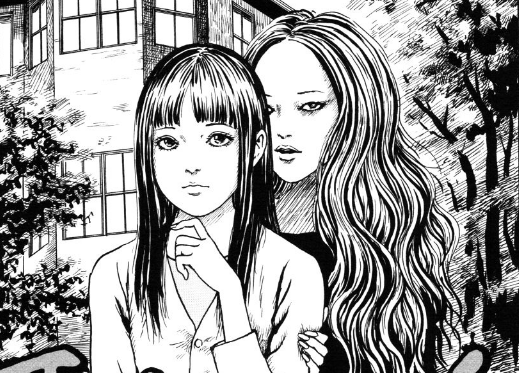

# Whispering Woman's Game

Java game inspired by Junji Ito's story 'Whispering Woman'.

Image credits: [Fairy Dharawat's Blog](https://fairydharawat.wordpress.com/2020/02/06/whispering-woman-by-junji-itou/)

# Context

A girl constantly asks what she should do, if the answear is not specific or detailed, she will continue asking and
becoming unable to do anything.

# Goal

Calm her and give her the properly answears, contributing to make her have normal routine.

# How to play ?

Run 'Game.java' 
Tested with Java 18.

# References

- [Junji Ito Wiki - Whispering Woman](https://junjiitomanga.fandom.com/wiki/Whispering_Woman)
